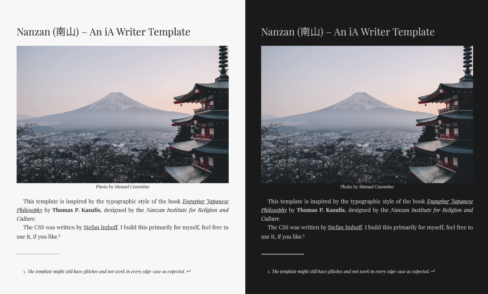

# Nanzan (南山) – An iA Writer Template

This template is inspired by the typographic style of the book
_[Engaging Japanese Philosophy](https://www.amazon.com/gp/product/0824874072/ref=as_li_tl?ie=UTF8&camp=1789&creative=9325&creativeASIN=0824874072&linkCode=as2)_ by **Thomas P. Kasulis**, designed
by the _Nanzan Institute for Religion and Culture_.

The CSS was written by [Stefan Imhoff](https://www.stefanimhoff.de/). I build this primarily for myself, feel free to use it, if you like.[^1]

[^1]: _The template might still have glitches and not work in every edge-case as expected_.
